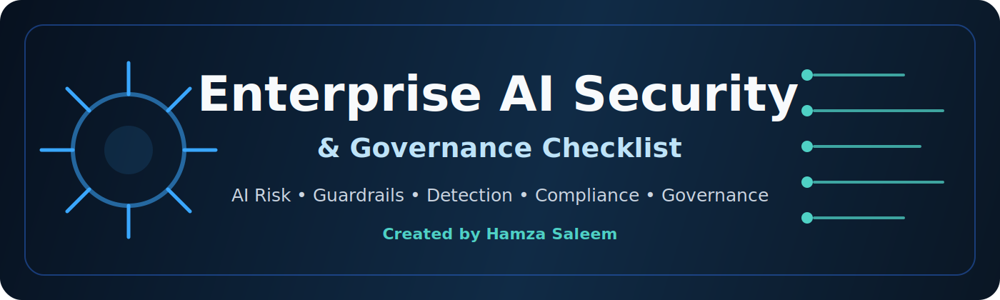
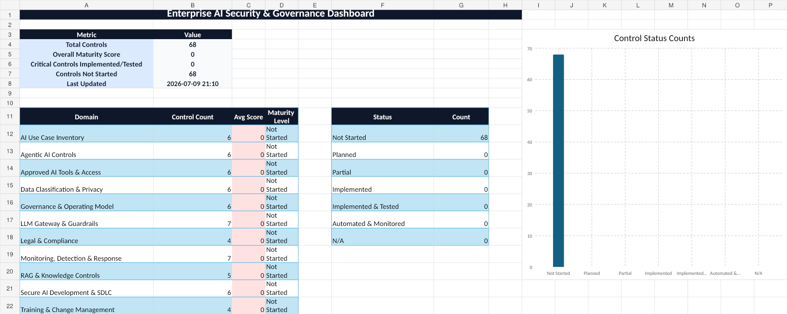

<p align="center">
  
</p>

<h1 align="center">Enterprise AI Security & Governance Checklist</h1>

<p align="center">
  A practical Excel-based tool to help organisations adopt AI safely with security controls, guardrails, detection, and governance.
</p>

<p align="center">
  <a href="tool/Enterprise_AI_Security_Governance_Checklist.xlsx"><b>Download Tool</b></a>
  ·
  <a href="docs/implementation-playbook.md"><b>Implementation Playbook</b></a>
  ·
  <a href="docs/framework-mapping.md"><b>Framework Mapping</b></a>
  ·
  <a href="docs/marketing-copy.md"><b>Share</b></a>
</p>

<p align="center">
  
  
  
  
</p>

---

## Why this tool exists

AI adoption is moving faster than most security programmes.

Employees are using ChatGPT, Claude, Gemini, Copilot, AI coding assistants, browser extensions, document summarisation tools, and agentic workflows in daily operations. The risk is not just “AI usage.” The real risk is **uncontrolled AI usage**.

Common questions security teams struggle with:

- Which AI tools are employees using?
- What data is being uploaded into AI tools?
- Are users pasting secrets, customer data, source code, or confidential documents?
- Do we have approved AI tools and clear usage rules?
- Can we detect Shadow AI?
- Do we have guardrails for prompts, file uploads, outputs, RAG, and agents?
- Who owns AI risk across Security, Engineering, Legal, Privacy, and GRC?

This checklist helps organisations move from **uncontrolled AI adoption** to **measurable AI risk management**.

---

## What is included

The Excel workbook includes:

| Area | Purpose |
|---|---|
| **Introduction** | Explains the purpose, author, scope, and how to use the tool |
| **Dashboard** | Shows AI security maturity and control status |
| **Control Checklist** | Main assessment with scoring, ownership, evidence, and status |
| **AI Asset Inventory** | Track AI tools, models, users, data types, and owners |
| **Guardrails Matrix** | Define controls for prompts, files, outputs, RAG, and agents |
| **Detection Library** | AI security detection use cases for SOC/SIEM teams |
| **Vendor Review** | Questions for AI SaaS, LLM providers, copilots, and AI platforms |
| **Incident Playbook** | Response guidance for AI-related security incidents |
| **Framework References** | Mapping to recognised AI/security frameworks |

---

## Control domains covered

```text
AI Governance
AI Asset Inventory
Approved AI Usage
Shadow AI Detection
Data Classification
DLP and Sensitive Data Protection
Prompt and Input Guardrails
Output Guardrails
LLM Gateway and Proxy Controls
RAG Security
Agentic AI Risk
AI Coding Assistant Controls
OAuth and SaaS AI Governance
Browser Extension Risk
Vendor Risk Management
AI Detection and Response
AI Incident Handling
Security Metrics and Reporting
```

---

## Scoring model

| Score | Meaning |
|---:|---|
| 0 | Not Started |
| 1 | Planned |
| 2 | Partially Implemented |
| 3 | Implemented |
| 4 | Implemented & Tested |
| 5 | Automated & Monitored |

The goal is not to “tick boxes.” The goal is to understand current maturity, identify gaps, prioritise controls, and improve safely over time.

---

## Example control

| Domain | Control | Assessment question |
|---|---|---|
| Data Protection | AI DLP scanning | Are prompts and uploaded files scanned for PII, secrets, source code, credentials, customer data, and confidential information before reaching external LLMs? |

---

## Recommended operating model

```text
Discover AI usage
        ↓
Approve tools and use cases
        ↓
Classify data risk
        ↓
Apply guardrails and DLP
        ↓
Route high-risk usage through approved AI gateway
        ↓
Detect Shadow AI and misuse
        ↓
Respond to AI incidents
        ↓
Report maturity and improve continuously
```

---

## Framework alignment

This tool is inspired by and mapped to concepts from:

- **NIST AI Risk Management Framework**
- **NIST Generative AI Profile**
- **ISO/IEC 42001 AI Management System**
- **ISO/IEC 23894 AI Risk Management**
- **OWASP Top 10 for LLM Applications**
- **MITRE ATLAS**
- **Cloud Security Alliance AI Controls Matrix**
- **EU AI Act risk concepts**

This is not an official implementation of any one standard. It is a practical checklist designed to make those ideas usable for security and governance teams.

---

## Who should use this

This tool is useful for:

- AI Security Engineers
- Security Architects
- Product Security teams
- GRC and Risk teams
- SOC and Detection Engineering teams
- CISOs and security leaders
- Engineering managers
- AI platform teams
- Consultants supporting secure AI adoption

---

## Download

Download the latest version here:

**[Enterprise AI Security & Governance Checklist](tool/Enterprise_AI_Security_Governance_Checklist.xlsx)**

For better tracking, future versions should also be published through **GitHub Releases**.

---

## Screenshots

<p align="center">
  
</p>

---

## Author

Created by **Hamza Saleem**.

I work across security engineering, detection, incident response, application security, and AI security. This checklist was created to help organisations adopt AI safely by combining practical security controls, governance, and detection engineering.

Connect with me on LinkedIn or follow this repository for updates.

---

## Contributing

Feedback, ideas, and pull requests are welcome.

Suggested contributions:

- Additional AI security controls
- Better framework mappings
- Detection use cases
- Vendor review questions
- LLM gateway patterns
- RAG and agentic AI controls
- Real-world lessons from AI adoption programmes

---

## Disclaimer

This tool is provided for educational and practical assessment purposes. It does not replace legal, regulatory, privacy, or professional security advice. Organisations should adapt the checklist to their business context, regulatory environment, and internal risk appetite.

---

<p align="center">
  <b>If this tool helps you, please star the repo and share feedback.</b>
</p>
